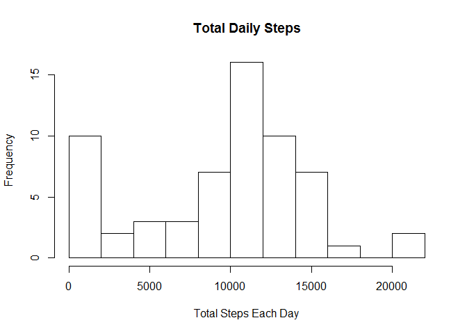
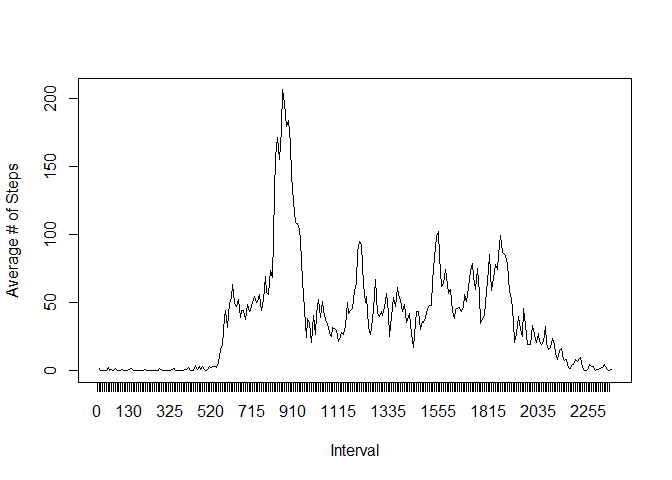
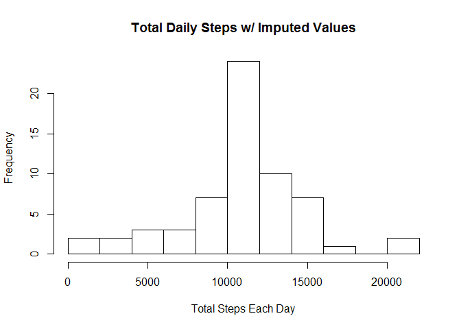
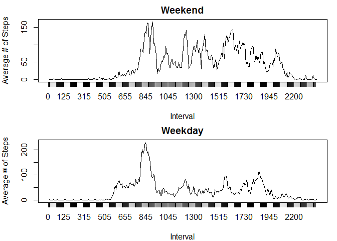

# Reproducible Research: Peer Assessment 1


## Loading and preprocessing the data

Check to see if the data file is already in the working directory. If it isn't there, 
download it and unzip it into the working directory. Then, load the data into a
dataframe ("activity") and get some information about the data with the str funtion.


```r
if(!file.exists("activity.csv")) {
    fileURL <- "https://d396qusza40orc.cloudfront.net/repdata%2Fdata%2Factivity.zip"
    download.file(fileURL, destfile = "factivity.zip")
    unzip(zipfile="factivity.zip")}

activity <- read.csv("activity.csv")
str(activity)
```

```
## 'data.frame':	17568 obs. of  3 variables:
##  $ steps   : int  NA NA NA NA NA NA NA NA NA NA ...
##  $ date    : Factor w/ 61 levels "2012-10-01","2012-10-02",..: 1 1 1 1 1 1 1 1 1 1 ...
##  $ interval: int  0 5 10 15 20 25 30 35 40 45 ...
```

Now we know that there are a total of 17568 observations over 61 days which
means there are 288 observations (or intervals) per day.

## What is mean total number of steps taken per day?

Calculate the total steps per day. Plot the data in a histogram. Report the mean
and median of the daily totals.


```r
dailytotal <- tapply(activity$steps, activity$date, sum, na.rm = TRUE)
hist(dailytotal, breaks = 10, xlab = "Total Steps Each Day", main = "Total Daily Steps")
```

<!-- -->

```r
mean(dailytotal)
```

```
## [1] 9354.23
```

```r
median(dailytotal)
```

```
## [1] 10395
```

## What is the average daily activity pattern?

Here the average number of steps for the five minute intervals
across all 61 days is calculated. The pattern is then plotted.


```r
meanstepsint <- tapply(activity$steps,activity$interval, mean, na.rm=TRUE)
msiDF <- data.frame("interval" = dimnames(meanstepsint)[[1]], 
                    "steps" =as.vector(meanstepsint))
plot(meanstepsint,type="l", xaxt = "n", xlab = "Interval", 
                                        ylab = "Average # of Steps")
x <- c(0:287)
axis(side = 1, at = x, labels = msiDF$interval)
```

<!-- -->

Next, the interval with the maximum number of steps is reported.


```r
maxsteps <- max(msiDF$steps)
for (i in 1:288) {
    if (msiDF[i, 2] == maxsteps) {
        print(as.character(msiDF[i,1]))
        break
    } else {
        next
    }
}
```

```
## [1] "835"
```


## Imputing missing values

Calculate and report the total number of missing values in the dataset
(i.e. the total number of rows with NAs).


```r
sum(is.na(activity$steps))
```

```
## [1] 2304
```

Fill in all of the missing values in the dataset using the mean for that 5-minute
interval.


```r
imp_activity <- activity
imp_activity$steps <- as.numeric(activity$steps)
for (i in 1:17568) {
    if (is.na(imp_activity$steps[i])) {
        for (j in 1:288) {
            if (as.character(msiDF$interval[j]) == as.character(imp_activity$interval[i])) {
                imp_activity$steps[i] <- msiDF$steps[j]
            } 
        }
    } 
}
```

Calculate the total steps per day. Plot the data in a histogram. Report the mean
and median of the daily totals.


```r
dailytotalimp <- tapply(imp_activity$steps, imp_activity$date, sum, na.rm = TRUE)
hist(dailytotalimp, breaks = 10, xlab = "Total Steps Each Day", main = "Total Daily Steps w/ Imputed Values")
```

<!-- -->

```r
mean(dailytotalimp)
```

```
## [1] 10766.19
```

```r
median(dailytotalimp)
```

```
## [1] 10766.19
```

The mean is higher than when the NAs were ignored using this imputation method.
Also, the mean is now equal to the median for these imputed data.

## Are there differences in activity patterns between weekdays and weekends?

Create a new factor variable in the dataset with two levels - "weekday" and 
"weekend" indicating whether a given date is a weekday or weekend day.


```r
stepdates <- as.POSIXlt(imp_activity$date)
dayoftheweek <-weekdays(stepdates)
wk <- c("Monday","Tuesday","Wednesday","Thursday","Friday")
wdwe <- sample(c("weekend", "weekday"), size = 17568, replace = TRUE)
weekorwkend <- factor(wdwe, levels = c("weekend", "weekday"))
for (i in 1:17568) {
    if (dayoftheweek[i] %in% wk) {
        weekorwkend[i] <- "weekday"
    } else {
        weekorwkend[i] <- "weekend"
    }
}
imp_activity$wkdayorwkend <- weekorwkend
```

Split the data by weekday/weekend. Look at the data with the str function.


```r
wksplit <- split(imp_activity$steps,imp_activity$wkdayorwkend)
str(wksplit)
```

```
## List of 2
##  $ weekend: num [1:4608] 0 0 0 0 0 0 0 0 0 0 ...
##  $ weekday: num [1:12960] 1.717 0.3396 0.1321 0.1509 0.0755 ...
```

With the knowledge of how many observations there are in each category, make
dataframes with the number of steps and the intervals


```r
wkendsteps <- data.frame(steps=wksplit[["weekend"]], interval=imp_activity$interval[1:4608])
wkdaysteps <- data.frame(steps=wksplit[["weekday"]], interval=imp_activity$interval[1:12960])
```

Here the average number of steps for the five minute intervals across all weekend
and weekday days is calculated.


```r
wkendmeanstepsint <- tapply(wkendsteps$steps,wkendsteps$interval, mean)
wkdaymeanstepsint <- tapply(wkdaysteps$steps,wkdaysteps$interval, mean)

wkendmsiDF <- data.frame("interval" = dimnames(wkendmeanstepsint)[[1]], 
                    "steps" =as.vector(wkendmeanstepsint))
wkdaymsiDF <- data.frame("interval" = dimnames(wkdaymeanstepsint)[[1]], 
                    "steps" =as.vector(wkdaymeanstepsint))
```

Make a panel plot containing a time series plot (i.e. type = "l") of the 5-minute
interval (x-axis) and the average number of steps taken, averaged across all
weekday days or weekend days (y-axis).


```r
par(mfrow = c(2,1), mar = c(4,4,2,1))
plot(wkendmeanstepsint,type="l", xaxt = "n", xlab = "Interval", 
     ylab = "Average # of Steps", main = "Weekend")
x <- c(0:287)
axis(side = 1, at = x, labels = wkendmsiDF$interval)
plot(wkdaymeanstepsint,type="l", xaxt = "n", xlab = "Interval", 
     ylab = "Average # of Steps", main = "Weekday")
x <- c(0:287)
axis(side = 1, at = x, labels = wkdaymsiDF$interval)
```

<!-- -->
